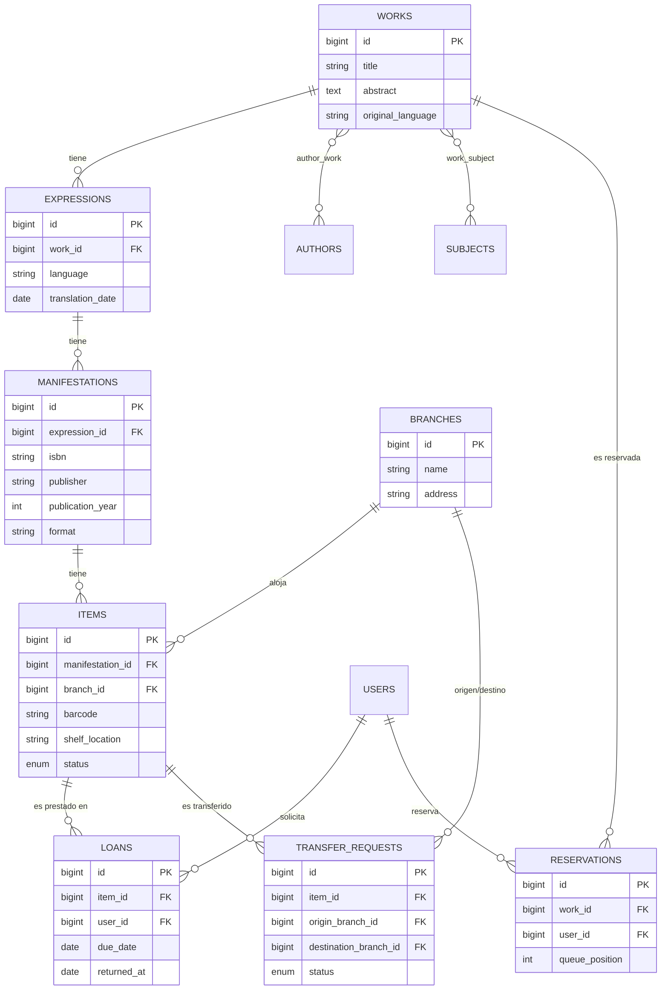
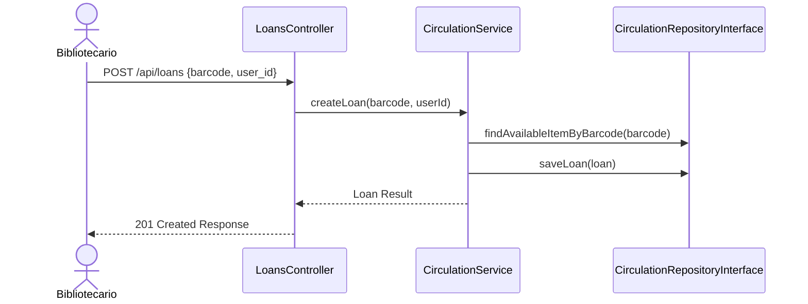
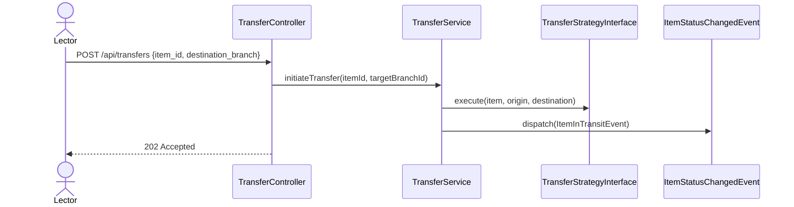
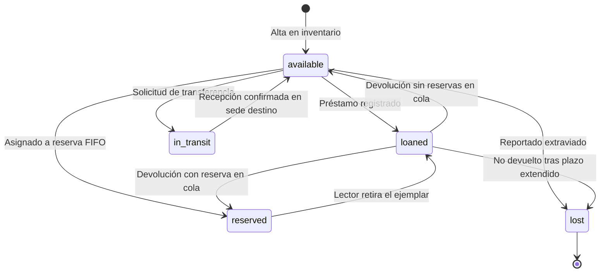

# Arquitectura del Sistema — Folium

## 1. Patrón Arquitectónico Global (Clean Architecture / Hexagonal)

Folium utiliza una arquitectura **Clean / Hexagonal (Puertos y Adaptadores)** desacoplada. La lógica del negocio (Dominio) es completamente independiente de frameworks, bases de datos y bibliotecas externas.

```mermaid
graph TD
    subgraph Frontend
        UI[Vue.js 3 SPA<br/>Pinia + Vue Router]
    end

    subgraph Infrastructure Layer
        Controller[REST Controllers<br/>Sanctum Auth]
        MeiliAdapter[MeilisearchSearcher]
        DBAdapter[Eloquent Repositories]
        WSAdapter[WebSocketNotifier]
        MailAdapter[EmailNotifier]
    end

    subgraph Domain Layer Contracts & Core
        SearcherContract[SearcherInterface]
        NotifierContract[NotifierInterface]
        CirculationRepo[CirculationRepositoryInterface]
        TransferStrategy[TransferStrategyInterface]

        CirculationSvc[CirculationService]
        TransferSvc[TransferService]
        RecommendSvc[RecommendationService]
    end

    UI -- REST JSON --> Controller
    Controller --> CirculationSvc
    Controller --> TransferSvc
    Controller --> RecommendSvc

    CirculationSvc --> CirculationRepo
    TransferSvc --> TransferStrategy
    RecommendSvc --> SearcherContract

    DBAdapter ..|> CirculationRepo
    MeiliAdapter ..|> SearcherContract
    WSAdapter ..|> NotifierContract
    MailAdapter ..|> NotifierContract
```

---

## 2. Abstrucción de Contratos (Domain Interfaces)

Para garantizar la extensibilidad y cumplir con el principio de inversión de dependencias:

| Contrato (Interface) | Implementaciones (Adapters) | Propósito |
| --- | --- | --- |
| `SearcherInterface` | `MeilisearchSearcher`, `DatabaseSearcher` | Motor de búsqueda full-text y facetado |
| `NotifierInterface` | `WebSocketNotifier`, `EmailNotifier`, `SMSNotifier` | Notificación asíncrona y en tiempo real |
| `TransferStrategyInterface` | `SameBranchTransfer`, `InterBranchTransfer` | Reglas de negocio para movimiento de ítems |
| `CirculationRepositoryInterface` | `EloquentCirculationRepository` | Abstracción de persistencia de préstamos |
| `WorkRepositoryInterface` | `EloquentWorkRepository` | Abstracción de persistencia de catálogo WEMI |

---

## 3. Modelo de Datos Relacional (MySQL) — Diagrama Entidad-Relación



---

## 4. Patrones de Diseño Aplicados

1. **Repository Pattern:** abstrae consultas de persistencia fuera de los controladores y servicios.
2. **Strategy Pattern:** encapsula variaciones en transferencia de ejemplares (`SameBranchTransfer` vs `InterBranchTransfer`).
3. **Service Pattern:** servicios puros (`CirculationService`, `TransferService`, `RecommendationService`) enfocados con responsabilidad única.
4. **Observer / Event-Driven Pattern:** notificaciones desacopladas en Listeners reaccionando a eventos del sistema.
5. **Dependency Injection:** todas las dependencias son inyectadas como interfaces mediante constructores.

---

## 5. Flujos de Secuencia

### Flujo de Préstamo



### Flujo de Transferencia Interbibliotecaria



---

## 6. Ciclo de Vida del Ejemplar (State Machine)


