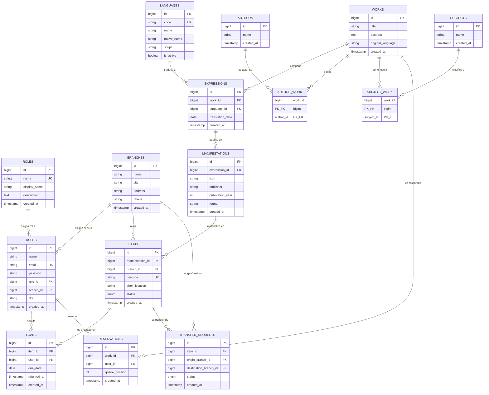
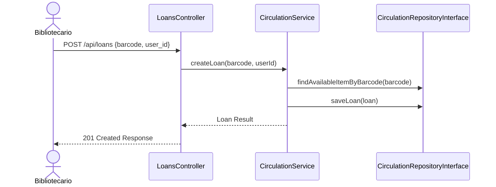
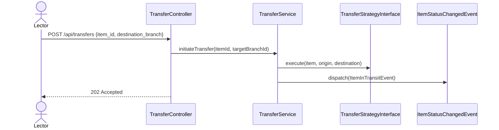
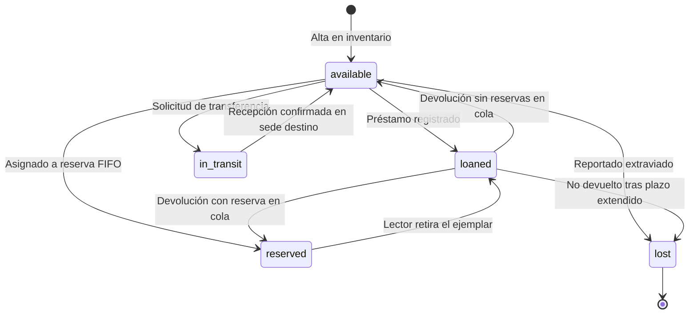

# Arquitectura del Sistema — Folium

## 1. Patrón Arquitectónico Global (Clean Architecture / Hexagonal)

Folium utiliza una arquitectura **Clean / Hexagonal (Puertos y Adaptadores)** desacoplada. La lógica del negocio (Dominio) es completamente independiente de frameworks, bases de datos y bibliotecas externas.

```mermaid
graph TD
    subgraph Frontend
        UI[Vue.js 3 SPA<br/>Pinia + Vue Router]
    end

    subgraph Infrastructure Layer
        Controller[REST Controllers<br/>Sanctum Auth]
        MeiliAdapter[MeilisearchSearcher]
        DBAdapter[Eloquent Repositories]
        WSAdapter[WebSocketNotifier]
        MailAdapter[EmailNotifier]
    end

    subgraph Domain Layer Contracts & Core
        SearcherContract[SearcherInterface]
        NotifierContract[NotifierInterface]
        CirculationRepo[CirculationRepositoryInterface]
        TransferStrategy[TransferStrategyInterface]

        CirculationSvc[CirculationService]
        TransferSvc[TransferService]
        RecommendSvc[RecommendationService]
    end

    UI -- REST JSON --> Controller
    Controller --> CirculationSvc
    Controller --> TransferSvc
    Controller --> RecommendSvc

    CirculationSvc --> CirculationRepo
    TransferSvc --> TransferStrategy
    RecommendSvc --> SearcherContract

    DBAdapter ..|> CirculationRepo
    MeiliAdapter ..|> SearcherContract
    WSAdapter ..|> NotifierContract
    MailAdapter ..|> NotifierContract
```

---

## 2. Abstrucción de Contratos (Domain Interfaces)

Para garantizar la extensibilidad y cumplir con el principio de inversión de dependencias:

| Contrato (Interface) | Implementaciones (Adapters) | Propósito |
| --- | --- | --- |
| `SearcherInterface` | `MeilisearchSearcher`, `DatabaseSearcher` | Motor de búsqueda full-text y facetado |
| `NotifierInterface` | `WebSocketNotifier`, `EmailNotifier`, `SMSNotifier` | Notificación asíncrona y en tiempo real |
| `TransferStrategyInterface` | `SameBranchTransfer`, `InterBranchTransfer` | Reglas de negocio para movimiento de ítems |
| `CirculationRepositoryInterface` | `EloquentCirculationRepository` | Abstracción de persistencia de préstamos |
| `WorkRepositoryInterface` | `EloquentWorkRepository` | Abstracción de persistencia de catálogo WEMI |
| `BranchRepositoryInterface` | `EloquentBranchRepository` | Gestión CRUD de sedes bibliotecarias de la red |
| `RoleRepositoryInterface` | `EloquentRoleRepository` | Gestión de roles y permisos de personal |
| `LanguageRepositoryInterface` | `EloquentLanguageRepository` | Gestión de idiomas ISO 639-1 del catálogo |

---

## 3. Modelo de Datos Relacional (MySQL) — Diagrama Entidad-Relación (ERD)



---

## 4. Patrones de Diseño Aplicados

1. **Repository Pattern:** abstrae consultas de persistencia fuera de los controladores y servicios.
2. **Strategy Pattern:** encapsula variaciones en transferencia de ejemplares (`SameBranchTransfer` vs `InterBranchTransfer`).
3. **Service Pattern:** servicios puros (`CirculationService`, `TransferService`, `RecommendationService`) enfocados con responsabilidad única.
4. **Observer / Event-Driven Pattern:** notificaciones desacopladas en Listeners reaccionando a eventos del sistema.
5. **Dependency Injection:** todas las dependencias son inyectadas como interfaces mediante constructores.

---

## 5. Flujos de Secuencia

### Flujo de Préstamo



### Flujo de Transferencia Interbibliotecaria



---

## 6. Ciclo de Vida del Ejemplar (State Machine)



---

## 7. Sistema de Diseño & Design Tokens (Identidad Editorial Folium)

La interfaz frontend (Vue 3 + Tailwind CSS) implementa una paleta cerrada denominada **Folium Brand Identity** registrada bajo el espacio de nombres `folium.*` en `tailwind.config.js`:

| Categoría Token | Nombre Token | Hexadecimal | Uso y Propósito en Interfaz |
| --- | --- | --- | --- |
| **Fondo / Pergamino** | `folium-canvas` | `#F9F6F0` | Fondo general de la aplicación |
| **Pergamino Tostado** | `folium-parchment` | `#F3EFE6` | Lienzo de tarjetas (`paper-card`), contenedores |
| **Marfil Cálido** | `folium-ivory` | `#FDFBF7` | Contenedores de búsqueda e inputs destacados |
| **Tinta Bosque** | `folium-ink` | `#152219` | Titulares principales, números de métricas |
| **Musgo Cenizo** | `folium-moss` | `#3C4A40` | Texto secundario y párrafos explicativos |
| **Salvia Seco** | `folium-sage` | `#66756A` | Micro-atribuciones y subtítulos |
| **Verde Laurel (Primario)**| `folium-forest` | `#2D5A3F` | Botones de acción primarios, foco, badges de stock |
| **Terracota / Cuero** | `folium-terracotta` | `#9E4E36` | Acento cálido principal, botones secundarios |
| **Terracota Profundo** | `folium-terracotta-deep`| `#7D3B28` | Texto de badges de materias y clasificaciones |
| **Terracota Suave** | `folium-terracotta-subtle`| `#F2E4DE` | Fondos de chips de género y clasificaciones Dewey |
| **Ámbar Cobre** | `folium-amber` | `#B87333` | Indicadores de traslados intersede (ILL) |
| **Granate / Carmesí** | `folium-crimson` | `#8C433E` | Mensajes de error inline y sin stock |

### Arquitectura de Validación Reactiva de Formularios

- **Sin validaciones nativas de navegador:** Todos los formularios especifican `<form novalidate @submit.prevent="...">`.
- **Estado Reactivo de Campo (`touched` state):** Monitoreado por objeto `reactive` en eventos `@blur` y `@input`.
- **Compilaciones Compuestas (`computed` validation):** Evaluación en tiempo real de `errors` y deshabilitación dinámica del botón de envío si el formulario es inválido.
- **Feedback Inline Editorial:** Bordes y textos de alerta en tono granate (`#8C433E`) o terracota (`#9E4E36`) integrados en el lienzo pergamino.
